# 2511 Notes

### General Info
http://webcms3.cse.unsw.edu.au/COMP2511/24T1/

Lecturer email: Dr Ashesh Mahidadia <a.mahidadia@unsw.edu.au>  
Course email: cs2511@cse.unsw.edu.au

#### Course Work (15%)
- Seven labs each 10 marks, best 6/7 labs count towards final grade

#### Assignment 1 (15%)
- Released Tuesday Week 2, `due Friday Week 5 at 5pm`
- Individual

#### Assignment 2 (20%)
- Released Thursday Week 5, `due Friday Week 9 at 5pm`
- Pairs

#### Assignment 3 (8%)
- Bonus Assessment
- Released Tuesday Week 8, `due Sunday Week 10 at 5pm`
- Individual or Pair

#### Final (50%)
- In person exam
- Hurdle: 40% (20 / 50)

## Java
- Simple, multi-threaded, garbage collected, object oriented, secure, platform independent
- `example.java` (java code) is compiled into `example.class` (java binary byte code), then it is run on the JVM (Java virtual machine) which is an interpreter which uses the JIT (Just in time compiler). 

## Object Oriented Programming (OOP) in Java
### Procedural Programming
- Groups of actions that perform some task are formed into functions and functions are grouped to form programs. 

### Object Oriented Programming
- Programmers create user-defined types called classes which contains `attributes` (properties) and `methods` (procedures) that manipulate the data. 

## Classes and Objects
A class is a collection of data and methods (procedures) that operate on that data.

- Objects refers to an instance of a class

```java
public class Circle {
    private int x = 1;
    private int y = 1;
    private int r = 1; 
    private static final double PI = 3.141592
    static int num_circles = 0;

    // Constructor with no params
    public Circle() {
        num_circles++;
    }

    // Constructor with params
    public Circle(int x, int y, int r) {
        // calls the constructor above, num_circles++
        this();

        this.setX(x);
        this.y = y;
        this.r = r;
    }

    // Methods
    public int getX() {
        return x;
    }

    public void setX(int x) {
        this.x = x; 
    }

    public double getArea() {
        return PI * r * r;
    }

    // Same method signature as superclass overrides it
    @Override
    public boolean equals(Object obj) {
        if (obj == null) { return false; }
        if (obj == this) { return true; }

        // Check if same class
        if (this.getClass() != obj.getClass()) {
            return false;
        }

        // Cast obj to Circle class
        Circle o = (Circle) obj;

        if (this.x != o.x && this.y != o.y && this.r != o.r) {
            return false;
        }

        return true;
    }

    public static void main(String[] args ) {
        Circle c = new Circle(0, 0, 5);
    }
}
```

## Subclasses and Inheritance
Inheritance refers to new classes inheriting the attributes and behaviours of existing classes.

```java
public class graphicalCircle extends Circle {
    public graphicalCircle(int x, int y, int r, Color o) {
        super(x, y, r);
        this.outline = o;
    }
}
```

## Superclasses
Every class has a superclass and if not defined, then the superclass is the class `Object`.

`Object` class: 
- Does not have a superclass 
- The methods defined by `Object` can be called by any Java object (instance). `toString(), equals(), hasCode()`

## Abstract Classes
Classes that define only part of the implementation, leaving subclasses to provide more specific methods.

- An abstract class cannot be instantiated.
- Subclass is instantiated by implementing all methods in abstract class.

```java
// Abstract class
public abstract class Shape {
    public abstract double area();
    public abstract double circumference();
}

public class Circle extends Shape {
    public abstract double area() {
        return 2 * PI * r;
    }

    public abstract double circumference() {
        return PI * r * r;
    }
}

public class Rectangle extends Shape {
    public abstract double area() {
        return l * w;
    }

    public abstract double circumference() {
        return 2 * (w + l);
    }
}
```

### Single Inheritance versus Multiple Inheritance
In Java, a new class can extend `exactly one superclass` (single inheritance)

Some object-oriented languages employ `multiple inheritance`, where a new class can have two or more super classes.

## Interfaces in Java
- All the methods defined within an interface are `implicitly abstract.`

<br>

- Variables declared in an interface must be `static` and `final`, that means, they must be `constants`

```java
public interface Drawable {
    public void setColour(Color C);
    public void setPosition(double x, double y);
}

public class DrawableRectangle implements Drawable {
   // methods
}
```

## Polymorphism (Overriding methods)
An object’s ability to decide what method to apply to itself.

```java
    class A {
        int i = 1;
        int f() { return i; }
    }

    class B extends A {
        int j;
        int f() {
            j = super.i + 1;
            return super.f() + j;
        }
    }
```
## Data Hiding and Encapsulation
### Access Modifiers
- public
    - visible to the world
- private
    - visible to the class only
- protected
    - visible to package and all subclasses
- default
    - visible to package

## Domain Models
Domain Models are used to `visually represent` important `domain concepts` and relationships between them.  

Domain – A sphere of knowledge particular to the problem being solved

## UML 
This course uses `Unified Modeling Language (UML)` to represent domain models (one of many different frameworks).

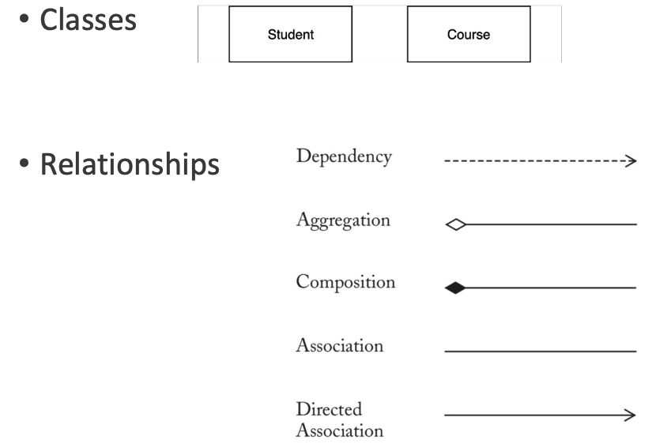

`Dependency`: The loosest form of relationship. A class in some way depends on another.

`Aggregation`: A class contains another class (a course contains students). Diamond is at the end with the containing class (course).

`Composition`: Like aggregation, but the contained class is `integral` to the containing class. The contained class cannot exist outside of the container (e.g. the leg of a chair)

`Association`: A class "uses" another class in some way. When undirected, it is not yet clear in what direction dependency occurs.

`Directed Association`: Refines association by indicating which class has knowledge of the other

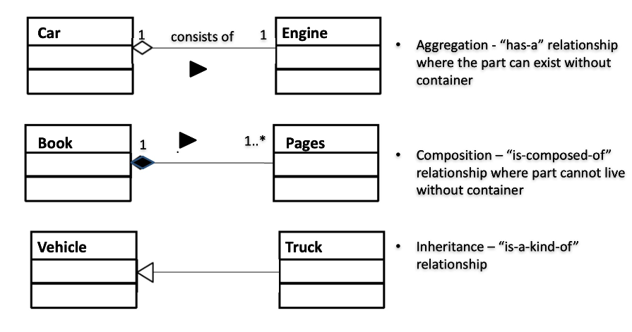


more info: https://www.uml-diagrams.org/

## Exceptions
An exception is an event, which occurs during the execution of a program. 

## Types of Exceptions
- Checked exception (IOEXception, SQLException)
- Error (VirtualMachineError, OutOfMemoryError)
- Runtime exception (ArrayIndexOutOfBoundsExceptions)

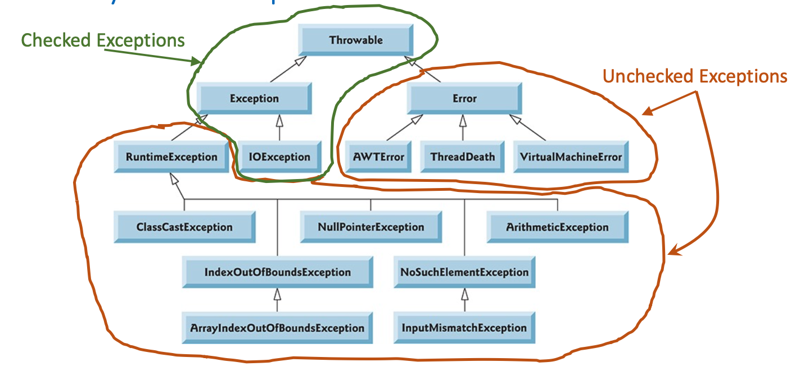

### UserDefined

```java
// Define exception
public class userDefinedException extends Exception {
    public userDefinedException(String message) {
        super(message);
    }
}

// Using exception
try {

} catch (userDefinedException e) {
    System.out.println(e.getMessage());
}
```

## Generics  
Generics enable types (classes and interfaces) to be parameters when defining:   
• classes  
• interfaces   
• methods

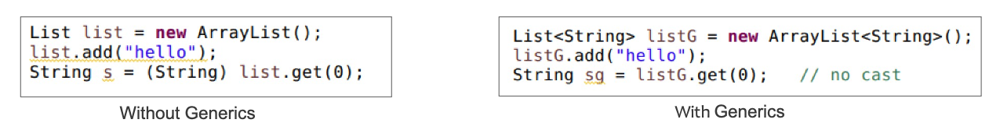

### Generic Types
- E - Element (used extensively by the Java Collections Framework) 
-  K - Key
- N - Number 
- T - Type
- V - Value
- S,U,V etc. - 2nd, 3rd, 4th types

```java
public class Box<T> {
    private T t;

    public void set(T t) {
        this.t = t;
    }

    public T get() {
        return t;
    } 
} 
``` 

### Generic Methods
```java
public class Util {
    public static <K, V> boolean compare(Pair<K, V> p1, 
                    Pair<K,V> p2) {
        return p1.getKey().equals(p2.getKey());
    } 
} 
```

## Collections
A **collections framework** is a unified architecture for representing and manipulating collections. 

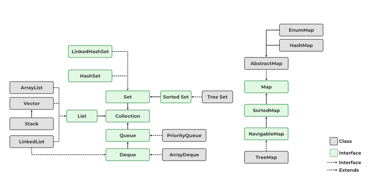
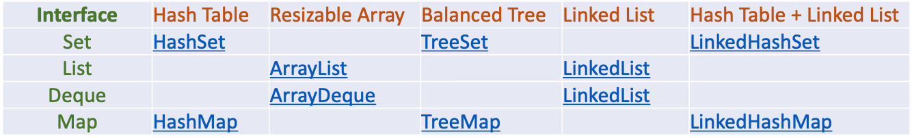

## Design By Contract (DBC)

### Pre-conditon
A **pre-condition** is a condition that must always be true just prior to the execution of some section of code.
- In inheritance, preconditions may be **weakened** (relaxed) in a subclass but cannot be strengthened
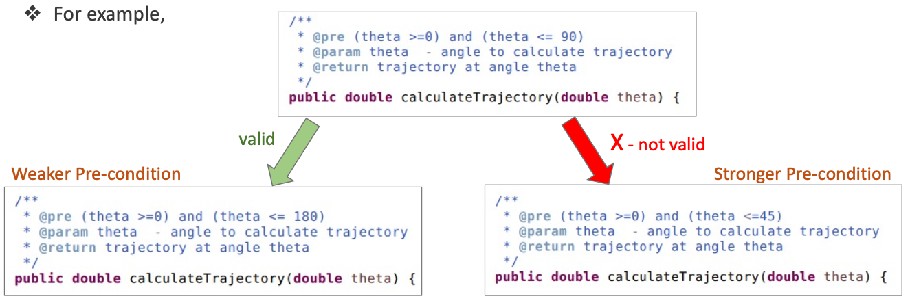

### Post-condition
A **post-condition** is a condition that must always be true just after the execution of some section of code.

- In inheritance, postconditions may **increase** benefits provided but not decrease.
  - original contract requires returning a `set`
  - edefinition (overridden method) returns `sorted set`

### Class Invariant
A class invariant constrains the state (i.e. values of certain variables) stored in the object.

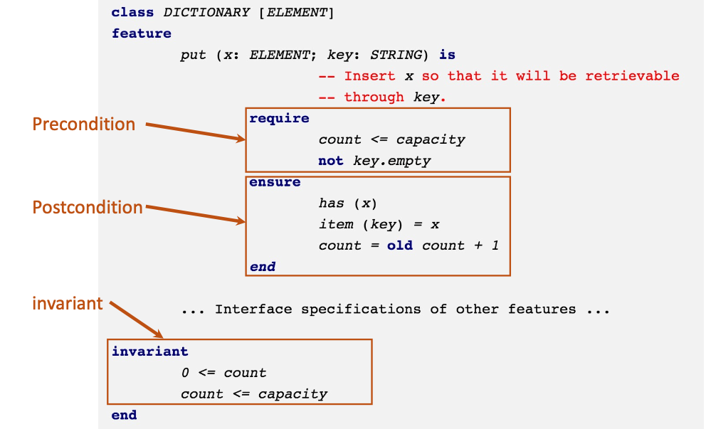

## JUnit Testing
JUnit is a popular unit testing (open source) framework for testing Java programs.

- **Test Case** – Java class containing test methods
- **Test Method** – a method that executes the test code, annotated with @Test, in a Test Case
- **Asserts** - asserts or assert statements check an expected result versus the actual result 
- **Test Suites** – collection of several Test Cases

## Design Principles
Software aims for building a system with **loose coupling** and **high cohesion**.
- Coupling is interdependence between components or classes
- Cohesion is degree in which elements work together 

### Pragmatic Programming
- DRY (Don't repeat yourself)
- KISS (Keep it simple stupid)
  


### Law of Demeter (Principle of least knowledge)
Classes should know about and interact with as few classes as possible.

```java
// good 
o.removeNode(name); 

// bad
o.get(name).get(thing).remove(node);
```

### Liskov Substitution Principle (LSP)
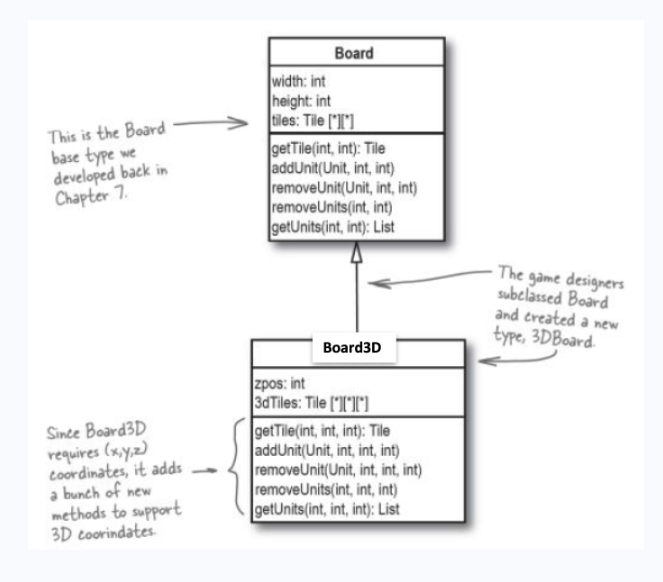

Not a good inheritance because none of the methods in Board can actually be used in Board3D, since all the methods have to be overwritten. 

### Common Code Smells
- Duplicated code
- Long methods
- Large class
- Long paramter list

## Method Overriding
- Method sigs must be exactly the same as super class
- Access modifiers like `public` must be consistent within sub class
- A `final` method cannot be overridden.
- A `static` method is unique to that class, so a sub class can have same method sig.

## Lambda Expressions
- Defines an anonymous methods, treating cade as data
- Pass functionality as method argument

```java
public interface A {
    public int myCompute(int x, int y);
}

A f1 = (x, y) -> x + y;

f1.myComute 

// ------

public interface B {
    public boolean myCompute(int x, int y);
}

B f2 = (x, y) -> x > y;

f2.myComute

// ------

public interface C {
    public double myCompute(int x);
}

C f3 = (x) -> {
    return x * 1.5;
};

f3.myComute
```

## Method Reference operator
`::` is a method reference 
- A `static` method `ClassName::methName`
- A **instance** method `instanceRef::methName` or `ClassName::methName`
- A class **constructor** `ClassName::new`

## Function Interfaces 
- Functional interfaces in `package java.util.function`, provide **predefined target types** for lambda expressions and method references.
- Each functional interface has a **single abstract method**, which the lambda expression's parameter and return types are matched or adapted.

  <br>

- `Function` - unary function from T to R
- `Consumer` - unary function from 
- `Predicate` - unary function from T to boolean
- `Supplier` - nilary function to R

```java 
Predicate<String> p = String::isEmpty;

List <String> strEmpty = strList.stream()
                                .filter(p)
                                .collect(Collectors.toList());

```

`Comparator` abstract method `compare` is mapped to `lambda` expression. 

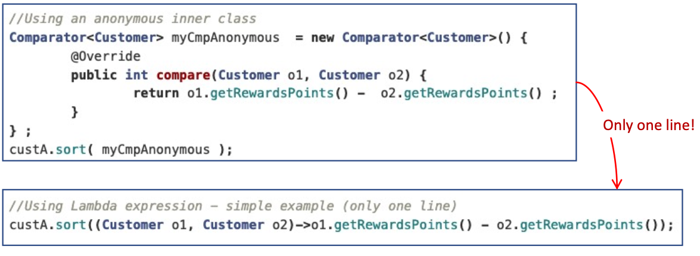

## Pipelines and Streams
A **pipeline** is a sequence of **aggregate** operations. 

Contains following components:
- **Source**: `Collection`, `Array`
- **Intermediate operation**:  `filter, forEach` produces a new stream
- A `stream` is a sequence of elements. Intermediate operations such as `filter` produces a new stream.

```java
double avergae = roster
    .stream()
    .filter(p -> p.getGender() == Person.Sex.MALE)
    .collect(Collectors.toList());
```

- Note: `.` operator in **pipelines** (like `|` in POSIX) are different to `.` operator in **instance** and **class**

## Strategy Pattern
- This allows you to **encapsulate** a family of algorithms and put each in a **seperate class** and make their objects **interchangable**.
- Avoid `if-else` and `switch-case` statements.

```java
// Strategy interface
interface Strategy {
    void doOperation();
}

// Concrete strategy 1
class ConcreteStrategy1 implements Strategy {
    public void doOperation() {}
}

// Concrete strategy 2
class ConcreteStrategy2 implements Strategy {
    public void doOperation() {}
}

// Context class
class Context {
    private Strategy strategy;

    public Context(Strategy strategy) {
        this.strategy = strategy;
    }

    public void executeStrategy() {
        strategy.doOperation();
    }
}

// User
public class Main {
    public static void main(String[] args) {

        Strategy strategy1 = new ConcreteStrategy1();
        Strategy strategy2 = new ConcreteStrategy2();
        
        Context context = new Context(strategy1);
        context.executeStrategy();
        
        context = new Context(strategy2);
        context.executeStrategy();
    }

    // Context class just simply uses the Strategy interface to execute the algorithm.
}
```

## State Pattern
State pattern allows an object to alter its **behavior** when its internal **state changes**. 

- A **finite-state machine (FSM)**, is an abstract machine that can be in exactly one of a **finite number of states** at any given time.

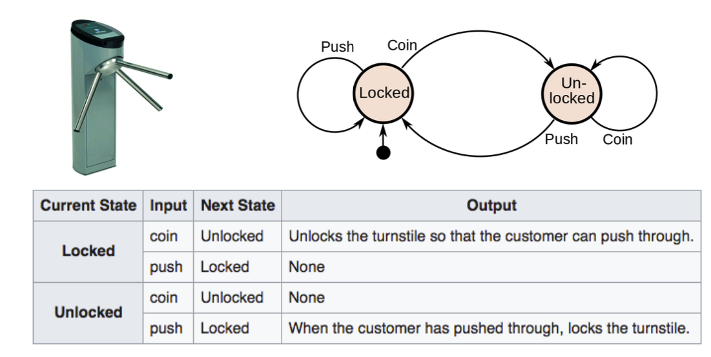

```java
// State interface
interface State {
    void handle(Context context);
}

// Concrete state 1
class ConcreteState1 implements State {
    public void handle(Context context) {
        System.out.println("Handling state 1");
        context.setState(new ConcreteState2());
    }
}

// Concrete state 2
class ConcreteState2 implements State {
    public void handle(Context context) {
        System.out.println("Handling state 2");
        context.setState(new ConcreteState1());
    }
}

// Context class
class Context {
    private State state;

    public Context(State initialState) {
        this.state = initialState;
    }

    public void setState(State state) {
        this.state = state;
    }

    public void request() {
        state.handle(this);
    }
}

public class Main {
    public static void main(String[] args) {
        // Create initial state
        State initialState = new ConcreteState1();
        
        // Create context with initial state
        Context context = new Context(initialState);
        
        // Request behavior based on the current state
        context.request(); // Output: Handling state 1
        
        // Change state and request behavior again
        context.request(); // Output: Handling state 2
    }
}
```

## Observer pattern & Event-Driven Programming
The **Observer Pattern** is used to implement distributed **event handling** systems, in "event driven" programming.

- **one-to-many** dependency between objects so that when one object (subject) changes state, all of its dependents (observers) are notified and updated automatically.

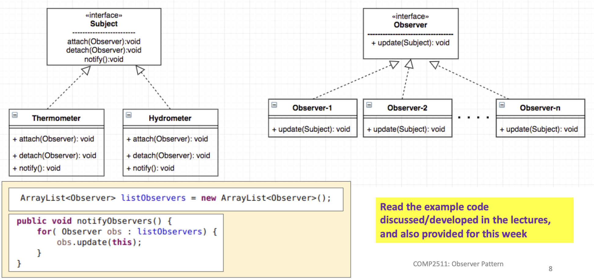

## Refactoring 

### Low-level refactoring 
All these can be done in the IDE.

- Renaming
- Extracting code to methods
- Reordering methods

### High-level refactoring 
- Refactoring to **design patterns**

## Smell: Long Method

### Refatoring Techniques - Extract Method
- More readable code, less duplication, less likely for errors
```java
// Non-extracted methods
public void debit(float amount) {
    balance -= amount;
    transactions.add(new Transaction(amount, true));
    lastTransactionDate = LocalDate.now().toString();
} 

// Extracted methods
public void debit(float amount) {
    deductBalacne(amount);
    recordTransaction(amount, true);
    recordLastTransaction();
}

private void deductBalacne(float amount) {
    balance -= amount;
}

private void recordTransaction(float amount, boolean isDebit) {
    transactions.add(new Transaction(amount, true));
}

private void recordLastTransaction() {
    lastTransactionDate = LocalDate.now().toString();
}
```

### Refatoring Techniques - Parameter Object 
- Method contains repeating graoup of parameters causing duplication
- Consolidate parameters into a `new class`
  
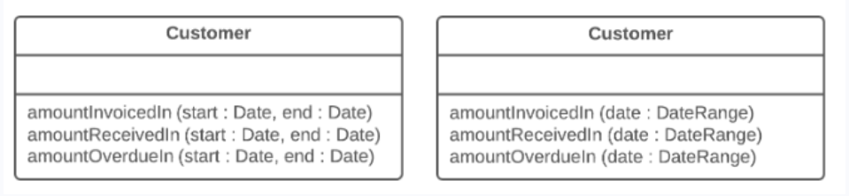

### Refatoring Techniques - Extract Class
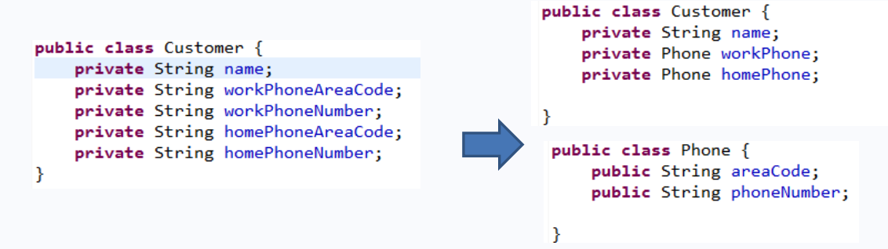

### Smell: Large Class
- Violates Single Responsibility Principle
- Large number of instance variables
- Several methods

**Solution**: `Extract Class` (above) or `Extract Sub-Class`

### Smell: Refused Bequest
- Subclass uses only some of the methods and properties inherited from its parents
- Unneeded methods may simply go unused or be redefined
and give off exceptions

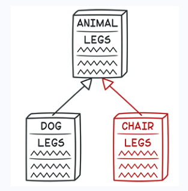

**Solution**: 
```java 
public abstract class Transport {
    public void drive() {
        // ... 
    }
}

public class Car extends Transport 

// doesnt make sense
public class Camel extends Transport

// -------------------------

// instead put drive() in Car Class
public class Car extends Transport {
    public void drive() {
        // ... 
    }
}

```

## Composition Pattern
In OO programming, a **composite** is an object designed as a composition of one-or-more **similar objects** (exhibiting similar functionality).
- Allows clients to treat composites and individual objects uniformly. No discrimination between a Single (leaf) Vs a Composite (group) object.

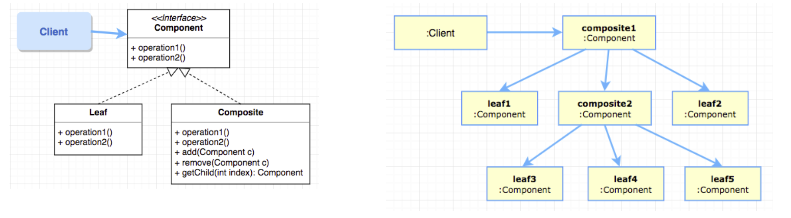

### Unifromity vs Type Safety
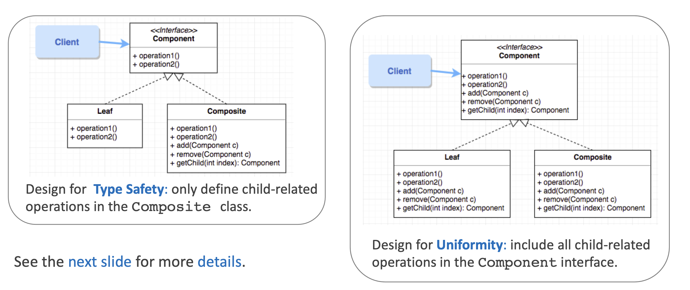

```java
Composite mainboard = new Composite("Mainboard", 100);
Leaf processor = new Leaf("Processor", 450);
Leaf memory    = new Leaf("Memory", 80);
mainboard.add(processor);
mainboard.add(memory);


Composite chasis = new Composite("Chasis", 75);
chasis.add(mainboard);

Component disk = new Leaf("Disk", 50);
chasis.add(disk);


System.out.println("[0] "+ processor.nameString());
System.out.println("[0] "+ processor.calculateCost());


System.out.println("[1] "+ mainboard.nameString());
System.out.println("[1] "+ mainboard.calculateCost());


System.out.println("[2] "+ chasis.nameString());
System.out.println("[2] "+ chasis.calculateCost());

// All use same interface: .nameString() and .calculateCost() 
```

## Factory Patterns
Factory method handles problem of creating objects **without** having to **specify the exact class** of the object that will be created.

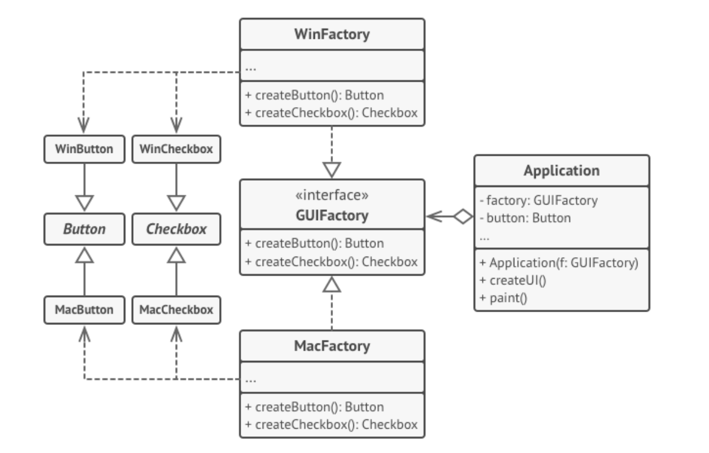
