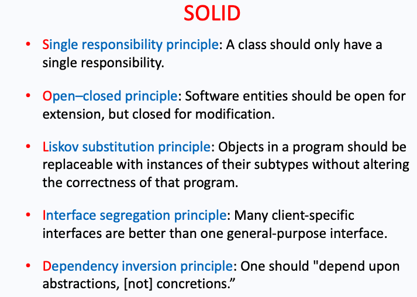
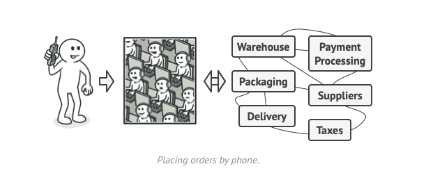

# 2511 Notes

### General Info
http://webcms3.cse.unsw.edu.au/COMP2511/24T1/

Lecturer email: Dr Ashesh Mahidadia <a.mahidadia@unsw.edu.au>  
Course email: cs2511@cse.unsw.edu.au

- https://refactoring.guru/

#### Course Work (15%)
- Seven labs each 10 marks, best 6/7 labs count towards final grade

#### Assignment 1 (15%)
- Released Tuesday Week 2, `due Friday Week 5 at 5pm`
- Individual

#### Assignment 2 (20%)
- Released Thursday Week 5, `due Friday Week 9 at 5pm`
- Pairs

#### Assignment 3 (8%)
- Bonus Assessment
- Released Tuesday Week 8, `due Sunday Week 10 at 5pm`
- Individual or Pair

#### Final (50%)
- In person exam
- Hurdle: 40% (20 / 50)

## Java
- Simple, multi-threaded, garbage collected, object oriented, secure, platform independent
- `example.java` (java code) is compiled into `example.class` (java binary byte code), then it is run on the JVM (Java virtual machine) which is an interpreter which uses the JIT (Just in time compiler). 

## Object Oriented Programming (OOP) in Java
### Procedural Programming
- Groups of actions that perform some task are formed into functions and functions are grouped to form programs. 

### Object Oriented Programming
- Programmers create user-defined types called classes which contains `attributes` (properties) and `methods` (procedures) that manipulate the data. 

## Classes and Objects
A class is a collection of data and methods (procedures) that operate on that data.

- Objects refers to an instance of a class

```java
public class Circle {
    private int x = 1;
    private int y = 1;
    private int r = 1; 
    private static final double PI = 3.141592
    static int num_circles = 0;

    // Constructor with no params
    public Circle() {
        num_circles++;
    }

    // Constructor with params
    public Circle(int x, int y, int r) {
        // calls the constructor above, num_circles++
        this();

        this.setX(x);
        this.y = y;
        this.r = r;
    }

    // Methods
    public int getX() {
        return x;
    }

    public void setX(int x) {
        this.x = x; 
    }

    public double getArea() {
        return PI * r * r;
    }

    // Same method signature as superclass overrides it
    @Override
    public boolean equals(Object obj) {
        if (obj == null) { return false; }
        if (obj == this) { return true; }

        // Check if same class
        if (this.getClass() != obj.getClass()) {
            return false;
        }

        // Cast obj to Circle class
        Circle o = (Circle) obj;

        if (this.x != o.x && this.y != o.y && this.r != o.r) {
            return false;
        }

        return true;
    }

    public static void main(String[] args ) {
        Circle c = new Circle(0, 0, 5);
    }
}
```

## Subclasses and Inheritance
Inheritance refers to new classes inheriting the attributes and behaviours of existing classes.

```java
public class graphicalCircle extends Circle {
    public graphicalCircle(int x, int y, int r, Color o) {
        super(x, y, r);
        this.outline = o;
    }
}
```

## Superclasses
Every class has a superclass and if not defined, then the superclass is the class `Object`.

`Object` class: 
- Does not have a superclass 
- The methods defined by `Object` can be called by any Java object (instance). `toString(), equals(), hasCode()`

## Abstract Classes
Classes that define only part of the implementation, leaving subclasses to provide more specific methods.

- An abstract class cannot be instantiated.
- Subclass is instantiated by implementing all methods in abstract class.

```java
// Abstract class
public abstract class Shape {
    public abstract double area();
    public abstract double circumference();
}

public class Circle extends Shape {
    public abstract double area() {
        return 2 * PI * r;
    }

    public abstract double circumference() {
        return PI * r * r;
    }
}

public class Rectangle extends Shape {
    public abstract double area() {
        return l * w;
    }

    public abstract double circumference() {
        return 2 * (w + l);
    }
}
```

### Single Inheritance versus Multiple Inheritance
In Java, a new class can extend `exactly one superclass` (single inheritance)

Some object-oriented languages employ `multiple inheritance`, where a new class can have two or more super classes.

## Interfaces in Java
- All the methods defined within an interface are `implicitly abstract.`

<br>

- Variables declared in an interface must be `static` and `final`, that means, they must be `constants`

```java
public interface Drawable {
    public void setColour(Color C);
    public void setPosition(double x, double y);
}

public class DrawableRectangle implements Drawable {
   // methods
}
```

## Polymorphism (Overriding methods)
An object’s ability to decide what method to apply to itself.

```java
    class A {
        int i = 1;
        int f() { return i; }
    }

    class B extends A {
        int j;
        int f() {
            j = super.i + 1;
            return super.f() + j;
        }
    }
```
## Data Hiding and Encapsulation
### Access Modifiers
- public
    - visible to the world
- private
    - visible to the class only
- protected
    - visible to package and all subclasses
- default
    - visible to package

## Domain Models
Domain Models are used to `visually represent` important `domain concepts` and relationships between them.  

Domain – A sphere of knowledge particular to the problem being solved

## UML 
This course uses `Unified Modeling Language (UML)` to represent domain models (one of many different frameworks).


`Dependency`: The loosest form of relationship. A class in some way depends on another.

`Aggregation`: A class contains another class (a course contains students). Diamond is at the end with the containing class (course).

`Composition`: Like aggregation, but the contained class is `integral` to the containing class. The contained class cannot exist outside of the container (e.g. the leg of a chair)

`Association`: A class "uses" another class in some way. When undirected, it is not yet clear in what direction dependency occurs.

`Directed Association`: Refines association by indicating which class has knowledge of the other


more info: https://www.uml-diagrams.org/

## Exceptions
An exception is an event, which occurs during the execution of a program. 

## Types of Exceptions
- Checked exception (IOEXception, SQLException)
  - Use `try` `catch`
  - Error at compile time
- Error (VirtualMachineError, OutOfMemoryError)
- Runtime exception (ArrayIndexOutOfBoundsExceptions)


### UserDefined

```java
// Define exception
public class userDefinedException extends Exception {
    public userDefinedException(String message) {
        super(message);
    }
}

// Using exception
try {

} catch (userDefinedException e) {
    System.out.println(e.getMessage());
}
```

## Generics  
Generics enable types (classes and interfaces) to be parameters when defining:   
• classes  
• interfaces   
• methods


### Generic Types
- E - Element (used extensively by the Java Collections Framework) 
-  K - Key
- N - Number 
- T - Type
- V - Value
- S,U,V etc. - 2nd, 3rd, 4th types

```java
public class Box<T> {
    private T t;

    public void set(T t) {
        this.t = t;
    }

    public T get() {
        return t;
    } 
} 
``` 

### Generic Methods
```java
public class Util {
    public static <K, V> boolean compare(Pair<K, V> p1, 
                    Pair<K,V> p2) {
        return p1.getKey().equals(p2.getKey());
    } 
} 
```

## Collections
A **collections framework** is a unified architecture for representing and manipulating collections. 


## Design By Contract (DBC)

### Pre-conditon
A **pre-condition** is a condition that must always be true just prior to the execution of some section of code.
- In inheritance, preconditions may be **weakened** (relaxed) in a subclass but cannot be strengthened


### Post-condition
A **post-condition** is a condition that must always be true just after the execution of some section of code.

- In inheritance, postconditions may **increase** benefits provided but not decrease.
  - original contract requires returning a `set`
  - edefinition (overridden method) returns `sorted set`

### Class Invariant
A class invariant constrains the state (i.e. values of certain variables) stored in the object.


## JUnit Testing
JUnit is a popular unit testing (open source) framework for testing Java programs.

- **Test Case** – Java class containing test methods
- **Test Method** – a method that executes the test code, annotated with @Test, in a Test Case
- **Asserts** - asserts or assert statements check an expected result versus the actual result 
- **Test Suites** – collection of several Test Cases

## Design Principles
Software aims for building a system with **loose coupling** and **high cohesion**.
- Coupling is interdependence between components or classes
- Cohesion is degree in which elements work together 

### Pragmatic Programming
- DRY (Don't repeat yourself)
- KISS (Keep it simple stupid)
  


**Interface segregation principle**: `interface` for flying animals, swimmming animals, land animals, no "animal" interface

### Law of Demeter (Principle of least knowledge)
Classes should know about and interact with as few classes as possible.

```java
// good 
o.removeNode(name); 

// bad
o.get(name).get(thing).remove(node);
```

### Liskov Substitution Principle (LSP)


Not a good inheritance because none of the methods in Board can actually be used in Board3D, since all the methods have to be overwritten. 

### Common Code Smells
- Duplicated code
- Long methods
- Large class
- Long paramter list

## Method Overriding
- Method sigs must be exactly the same as super class
- Access modifiers like `public` must be consistent within sub class
- A `final` method cannot be overridden.
- A `static` method is unique to that class, so a sub class can have same method sig.

## Lambda Expressions
- Defines an anonymous methods, treating cade as data
- Pass functionality as method argument

```java
public interface A {
    public int myCompute(int x, int y);
}

A f1 = (x, y) -> x + y;

f1.myComute 

// ------

public interface B {
    public boolean myCompute(int x, int y);
}

B f2 = (x, y) -> x > y;

f2.myComute

// ------

public interface C {
    public double myCompute(int x);
}

C f3 = (x) -> {
    return x * 1.5;
};

f3.myComute
```

## Method Reference operator
`::` is a method reference 
- A `static` method `ClassName::methName`
- A **instance** method `instanceRef::methName` or `ClassName::methName`
- A class **constructor** `ClassName::new`

## Function Interfaces 
- Functional interfaces in `package java.util.function`, provide **predefined target types** for lambda expressions and method references.
- Each functional interface has a **single abstract method**, which the lambda expression's parameter and return types are matched or adapted.

  <br>

- `Function` - unary function from `T` to `R`
- `Consumer` - unary function from `T` to `void`
- `Predicate` - unary function from `T` to `boolean`
- `Supplier` - nilary function from `void` to `R`

```java 
Predicate<String> p = String::isEmpty;

List <String> strEmpty = strList.stream()
                                .filter(p)
                                .collect(Collectors.toList());

```

`Comparator` abstract method `compare` is mapped to `lambda` expression. 


## Pipelines and Streams
A **pipeline** is a sequence of **aggregate** operations. 

Contains following components:
- **Source**: `Collection`, `Array`
- **Intermediate operation**:  `filter, forEach` produces a new stream
- A `stream` is a sequence of elements. Intermediate operations such as `filter` produces a new stream.

```java
double avergae = roster
    .stream()
    .filter(p -> p.getGender() == Person.Sex.MALE)
    .collect(Collectors.toList());
```

- Note: `.` operator in **pipelines** (like `|` in POSIX) are different to `.` operator in **instance** and **class**

## Strategy Pattern
Strategy is a behavioral design pattern that **encapsulates** a family of algorithms, places them into a separate class, and make their objects interchangeable.

- allows clients to switch algorithms dynamically without altering the code structure.
- Avoid `if-else` and `switch-case` statements.
- Example: Modes of Transport

```java
public interface Strategy {
   public int doOperation(int num1, int num2);
}
```

```java
public class OperationAdd implements Strategy {
   @Override
   public int doOperation(int num1, int num2) {
      return num1 + num2;
   }
}
```

```java
public class OperationSubstract implements Strategy {
   @Override
   public int doOperation(int num1, int num2) {
      return num1 - num2;
   }
}
```

```java
public class Context {
   private Strategy strategy;

   public Context(Strategy strategy){
      this.strategy = strategy;
   }

   public int executeStrategy(int num1, int num2){
      return strategy.doOperation(num1, num2);
   }
}
```
```java 
public class StrategyPatternDemo {
   public static void main(String[] args) {
      // Context class here can be used with both add and subtract
      Context context = new Context(new OperationAdd());		
      context = new Context(new OperationSubstract());		
   }
}
```

### Other examples
Sorting Algorithms: bubble sort, selection sort, insertion sort, quick sort, merge sort
- can change between sorting at any time

## State Pattern
State is a **behavioral design pattern** that lets an object alter its **behavior** when its **internal state changes**. It appears as if the object changed its class.

- A **finite-state machine (FSM)**, is an abstract machine that can be in exactly one of a **finite number of states** at any given time.
- Example: Traffic Lights


```java
interface State {
    void handle(Context context);
}
```

```java
class ConcreteState1 implements State {
    public void handle(Context context) {
        System.out.println("Handling state 1");
        context.setState(new ConcreteState2());
    }
}
```
```java
class ConcreteState2 implements State {
    public void handle(Context context) {
        System.out.println("Handling state 2");
        context.setState(new ConcreteState1());
    }
}
```
```java
class Context {
    private State state;

    public Context(State initialState) {
        this.state = initialState;
    }

    public void setState(State state) {
        this.state = state;
    }

    public void request() {
        state.handle(this);
    }
}
```
```java
public class Main {
    public static void main(String[] args) {
        State initialState = new ConcreteState1();
        Context context = new Context(initialState);
        
        context.request(); // Output: Handling state 1
        context.request(); // Output: Handling state 2
    }
}
```

## Observer pattern & Event-Driven Programming
Observer is a **behavioral design pattern** that lets you define a subscription mechanism to notify multiple objects about any events that happen to the object they’re observing.

- Used to implement distributed **event handling** systems, in "event driven" programming.

- **one-to-many** dependency between objects so that when one object (subject) changes state, all of its dependents (observers) are notified and updated automatically.


## Refactoring 

### Low-level refactoring 
All these can be done in the IDE.

- Renaming
- Extracting code to methods
- Reordering methods

### High-level refactoring 
- Refactoring to **design patterns**

## Smell: Long Method

### Refatoring Techniques - Extract Method
- More readable code, less duplication, less likely for errors
```java
// Non-extracted methods
public void debit(float amount) {
    balance -= amount;
    transactions.add(new Transaction(amount, true));
    lastTransactionDate = LocalDate.now().toString();
} 

// Extracted methods
public void debit(float amount) {
    deductBalacne(amount);
    recordTransaction(amount, true);
    recordLastTransaction();
}

private void deductBalacne(float amount) {
    balance -= amount;
}

private void recordTransaction(float amount, boolean isDebit) {
    transactions.add(new Transaction(amount, true));
}

private void recordLastTransaction() {
    lastTransactionDate = LocalDate.now().toString();
}
```

### Refatoring Techniques - Parameter Object 
- Method contains repeating graoup of parameters causing duplication
- Consolidate parameters into a `new class`
  


### Refatoring Techniques - Extract Class


### Smell: Large Class
- Violates Single Responsibility Principle
- Large number of instance variables
- Several methods

**Solution**: `Extract Class` (above) or `Extract Sub-Class`

### Smell: Refused Bequest
- Subclass uses only some of the methods and properties inherited from its parents
- Unneeded methods may simply go unused or be redefined
and give off exceptions


**Solution**: 
```java 
public abstract class Transport {
    public void drive() {
        // ... 
    }
}

public class Car extends Transport 

// doesnt make sense
public class Camel extends Transport

// -------------------------

// instead put drive() in Car Class
public class Car extends Transport {
    public void drive() {
        // ... 
    }
}

```

## Composition Pattern
A **composite** is a structural design pattern, designed as a composition of one-or-more **similar objects**.

- Aim is to be able to manipulate a single instance of the object just as we would manipulate a group of them. For example,
   - calculating size of a file should be same as a directory.


- Allows clients to treat composites and leaf objects uniformly. 


### Unifromity vs Type Safety


- Define a unified Component `interface` for both
Leaf (single / part ) objects and Composite (Group / whole) objects.

```java
public interface Component {
    public String nameString();
    public String calculateCost();
}
```

```java
class Leaf implements Component {
    @Override
    public String nameString() {}

    @Override
    public String calculateCost() {}
}
```

```java
class Composite implements Component {
    @Override
    public String nameString() {}

    @Override
    public String calculateCost() {}
}
```


```java
Composite mainboard = new Composite("Mainboard", 100);
Leaf processor = new Leaf("Processor", 450);
Leaf memory = new Leaf("Memory", 80);
mainboard.add(processor);
mainboard.add(memory);

// using functions on composite 
mainboard.nameString();
mainboard.calculateCost();

// using functions on leaf 
processor.nameString();
processor.calculateCost();
```

## Factory Method
**Factory Method** is a **creational design pattern** that provides an interface for creating objects in a superclass, but allows subclasses to alter the type of objects that will be created.

```java
abstract class Department {
    public abstract function createEmployee($id);

    public function fire($id) {
        $employee = $this->createEmployee($id);
        $employee->paySalary();
        $employee->dismiss();
    }
}

class ITDepartment extends Department {
    public function createEmployee($id) {
        return new Programmer($id);
    }
}

class AccountingDepartment extends Department {
    public function createEmployee($id) {
        return new Accountant($id);
    }
}
```

## Abstract Factory Pattern
**Abstract Factory** is a **creational design pattern** that lets you produce **families of related objects** without specifying their **concrete classes.**
- example: windows and mac factories

```java
interface GUIFactory {
    Button createButton();
    CheckBox createCheckBox();
}
```

```java
class WinFactory implements GUIFactory {
    public Button createButton() {
        return new WinButton();
    }

    public CheckBox createCheckBox() {
        return new WinCheckBox();
    }
}
```
```java
class MacFactory implements GUIFactory {
    public Button createButton() {
        return new MacButton();
    }

    public CheckBox createCheckBox() {
        return new MacCheckBox();
    }
}
```
```java
public class Main {
    GUIFactory factory;
    config = readApplicationConfigFile()

    if (config.OS.equals("Windows")) {
        factory = new WinFactory();
    } else if (config.OS.equals("Mac")) {
        factory = new MacFactory();
    }

    factory.createButton();
    factory.createCheckBox();
}
```


## Decorator Pattern
- Decorator pattern is a structurals design pattern that allow us to selectively add functionality to an object at **runtime dynamically**.
- Original class **unchanged** (Open-close principle)
- Difference to `Strategy Pattern` is strategy pattern you need to provide **strategies** when created. `Decorator pattern` you can add on **decorations** after initial object has been created.


```java
public interface ChristmasTree {
    String decorate();
}
```
```java
// Implementation of basic christmas tree
public class ChristmasTreeImpl implements ChristmasTree {
    @Override
    public String decorate() { return "Christmas tree"; }
}
```
```java
public abstract class TreeDecorator implements ChristmasTree {
    private ChristmasTree tree;
    
    @Override
    public String decorate() {
        return tree.decorate();
    }
}
```

```java
public class BubbleLights extends TreeDecorator {

    public BubbleLights(ChristmasTree tree) {
        super(tree);
    }
    
    public String decorate() {
        return super.decorate() + decorateWithBubbleLights();
    }
    
    private String decorateWithBubbleLights() {
        return " with Bubble Lights";
    }
}
```

```java
@Test
public void test() {
     
ChristmasTree tree = new ChristmasTreeImpl();
ChristmasTree bubbleTree = new BubbleLights(tree);

assertEquals(tree.decorate(), 
    "Christmas tree with Bubble Lights");
}
```

## Generics Extended
### Bounded Type Parameters
- You can restrict the types that can be used as type arguments in a parameterized type.
- A method that operates on numbers might only want to accept instances of `Number` or its subclasses.

```java
public <U extends Number> void inspect(U u) {}
public class NaturalNumber <T extends Integer> {}
```

## Multiple Bounds

### Upper bounding
```java
<T extends B1 & B2 & B3>
```
- A type variable with multiple bounds is a subtype of all the types listed in the bound.
- `B1, B2, B3` refer to `interfaces` or a `class`. Only **one** class and **rest** will be interfaces
- `class` MUST be specified before interfaces

### Lower bounding
`<? super Integer>`

- Not used very much
  
## Generics, Inheritance, and Subtypes
`Box<Number>` is not the superclass`Box<Integer>`, cannot be treated the same.

`List<String>` is the supertype of `ArrayList<String>` so they can be used together.

## Wildcards
`?` is called a wildcard and it represents an unknown type. 
- Not same as `T` because if you do `method(T a, T b)`, both `a` and `b` are the same type.
- In `method(? a, ? b)`, `a` and `b` can be different types


## Singleton Pattern
Singleton is a creational design pattern that ensures a class has only **one instance**, while providing a global access point to this instance.

- `private` constructor 
- `public static` creation method acting as constructor. This method calls the private constructor.


 
 ## Concurrency
- Java, allow for concurrent execution of multiple threads
- Multi-core hardware allow for mutliple threads to be run in parallel.
- Thread safe: many threads can access the same resources without exposing incorrect behaviour or causing unpredicatble outcomes.
  
### Thread Safety
- **Time slicing** in Java refers to the process of allocating time to threads.
- The order in which the threads run is uncertain. Unpredictable how many statements of one thread run before some of the other thread's statements run.


### Synchronized
- A `synchronized` method acquires the lock of the object or class at the start, executes the method, and then releases the lock at the end.
- `synchronized` keyword allows only one thread to execute the method, avoiding concurrency issues.

```java
public synchronized void 
```

## Template Pattern
**Template pattern** is a **behavioral design pattern** that defines the skeleton of an algorithm in the superclass but lets subclasses override specific steps of the algorithm without changing its structure.
- Example: opening **csv, doc and pdf** files

```java
abstract class AbstractClass {
    // Template method defining the algorithm
    public void templateMethod() {
        stepOne();
        stepTwo();
    }

    // Abstract methods to be implemented by subclasses
    protected abstract void stepOne();
    protected abstract void stepTwo();
}
```
```java
// Custom implementation in ConcreteClass1
class ConcreteClass1 extends AbstractClass {
    @Override
    protected void stepOne() {
        System.out.println("Step one in ConcreteClass1");
    }

    @Override
    protected void stepTwo() {

        System.out.println("Step two in ConcreteClass1");
    }
}
```
```java
// Custom implementation in ConcreteClass2
class ConcreteClass2 extends AbstractClass {
    @Override
    protected void stepOne() {
        System.out.println("Step one in ConcreteClass2");
    }

    @Override
    protected void stepTwo() {
        System.out.println("Step two in ConcreteClass2");
    }
}
```
```java

public class Main {
    public static void main(String[] args) {
        AbstractClass object1 = new ConcreteClass1();
        AbstractClass object2 = new ConcreteClass2();

        // Calling the template method
        object1.templateMethod();
        object2.templateMethod();
    }
}
```

### Template vs Strategy pattern
- **Template Pattern** works at the class level, so it’s `static`. Based on inheritance, alter parts of an algorthm by extending subclasses.
- **Strategy Pattern** works the object level, letting you switch behaviors at **runtime**. 

<br>

- You can use **both template and strategy pattern**, for example if you have f2f and online shoppers, and a buying process. The f2f vs online would be `strategy pattern` and the buying process (apple pay, google pay)  would be `template pattern`.

## Adapter Pattern
**Adapter** is a **structural design pattern** that allows objects with incompatible interfaces to collaborate.

- Convert the interface of a class into another interface clients expect.
- Adapter lets classes work together that couldn't otherwise because of incompatible interfaces.
- Example: Converting between `xml` and `json`

## Visitor Pattern 
Visitor is a behavioral pattern that adds new operations/behaviors to the existing objects, without modifying them.
- Ability to add new operations to existing object structures without modifying the structures.
- Example: Visiting every part of a car.


```java
// VISITABLE
interface CarPartVisitable {
    void accept(CarPartVisitor visitor);
}
```

```java
// Leaf objects car parts
class Engine implements CarPartVisitable {
    @Override
    public void accept(CarPartVisitor visitor) {
        visitor.visit(this);
    }
}

class Wheel implements CarPartVisitable {
    @Override
    public void accept(CarPartVisitor visitor) {
        visitor.visit(this);
    }
}
```

```java
// Compound object car
class Car {
    private List<CarPartVisitable> parts = new ArrayList<>();

    public void addPart(CarPartVisitable part) {
        parts.add(part);
    }

    public void accept(CarPartVisitor visitor) {
        for (CarPart part : parts) {
            part.accept(visitor);
        }

        visitor.visit(this);
    }
}
```

```java
// VISITOR
interface CarPartVisitor {
    void visit(Car car);
    void visit(Engine engine);
    void visit(Wheel wheel);
}
```

```java
// visit method, with argument dependent on each part
class CarPartPriceVisitor implements CarPartVisitor {
    @Override
    public void visit(Car car) {
        System.out.println("Price of Car: $50000 ");
    }

    @Override
    public void visit(Engine engine) {
        System.out.println("Price of Engine: $1000"); 
    }

    @Override
    public void visit(Wheel wheel) {
        System.out.println("Price of Wheel: $100");
    }
}
```

```java
public class Main {
    public static void main(String[] args) {
        Car car = new Car();
        car.addPart(new Engine());
        car.addPart(new Wheel());
        car.accept(new CarPartPriceVisitor());
    }
}
```

## Iterator Pattern
**Iterator Pattern** is a behavioral design pattern that extracts the traversal behaviour of a collection into a seperate object called an `iterator`. 

`Iterators` are objects that allows you to traverse a container.
- Access contents while abstracting representation of data structure.
- EG. loops are abstractors for iterators.

<br>

**Iterable** is an object that can be iterated over. 
- All iterators are iterable, but not all iterables are iterators 
- For loops only need to be given something iterable

## Builder Pattern
Builder is a **creational design pattern** that lets you construct complex objects step by step. 
- The pattern allows you to produce different types and representations of an object using the same construction code.
- Extract the object construction code out of its own class and move it to separate objects called `builders`.
- Example: Building different types of cars


```java
// Car.java
class Car {
    public Car(String type) {
        this.type = type;
    }

    public void setSeats(int seats) {
        this.seats = seats;
    }

    public void setEngine(String engine) {
        this.engine = engine;
    }
}
```

```java
// CarBuilder.java
interface CarBuilder {
    void setType(String type);
    void setSeats(int seats);
    void setEngine(String engine);

    Car getResult();
}
```

```java
// CarBuilderImpl.java
class CarBuilderImpl implements CarBuilder {
    private Car car;

    public CarBuilderImpl(String type) {
        car = new Car(type);
    }

    public void setType(String type) {
        car.setType(type);
    }

    public void setSeats(int seats) {
        car.setSeats(seats);
    }

    public void setEngine(String engine) {
        car.setEngine(engine);
    }

    public Car getResult() {
        return car;
    }
}
```

```java
// Director.java
class Director {
    public void constructSUV(CarBuilder builder) {
        builder.setType("SUV");
        builder.setSeats(5);
        builder.setEngine("V8");
    }

    public void constructSportsCar(CarBuilder builder) {
        builder.setType("Sports Car");
        builder.setSeats(2);
        builder.setEngine("V12");
    }
}

```
```java
public class Main {
    Director director = new Director();
    
    CarBuilder suvBuilder = new CarBuilderImpl("SUV");
    director.constructSUV(suvBuilder);
    Car suv = suvBuilder.getResult();

    CarBuilder sportsCarBuilder = new CarBuilderImpl("Sports Car");
    director.constructSportsCar(sportsCarBuilder);
    Car sportsCar = sportsCarBuilder.getResult();
}
```

## Synchronous and Asynchronous Design
**Synchronous** programming operations are carried out **in order**.
- Execution of an operation is **dependent upon** the completion of the **previous** operation
- Tasks (functions) A, B, and C are executed in a **sequence**, often using one thread.

**Asynchronous** programming operations are carried out **independently**

- The execution of an operation is not depdendent upon the completion of the **previous** operation
- Tasks (functions) A, B, and C are executed **independently**, can use multiple threads/resources.


## Microservices Software Design
### Monolithic Architecture
- **Long cycle** times for building, testing, and releasing.
- **Lack of agility**, hinders progress of innovations
- Reusability is difficult and difficult to scale


### Microservices Architecture
- **Architectural pattern** that arranges an application as a collection of **loosely coupled** services.
- Each service is independently **designed, developed, deployed, and maintained**.
- Often developed based on **functionality**: 
  - manage shipping
  - inventory management service
- Utilise the appropriate `APIs` to communicate with other services


### Advantages of Microservices
- **Individual services** can be **added, updated or replaced** without affecting other services
- Only **in-demand** services need to be scaled

## Command Pattern
Command is a **behavioral design pattern** that turns a request into a stand-alone object that contains all information about the request. 
- Decouple action **request** from object performing action


```java
public class Stock { 
    public Stock(String name, int qty){
        this.name = name;
        this.quantity = qty;
    }

    public void buy(){
       System.out.println(name + quantity);
    }
    public void sell(){
       System.out.println(name + quantity);
    }    
}
```
```java
public interface Order {
    void execute();
}
```
```java
public class BuyStock implements Order {
   private Stock abcStock;

   public BuyStock(Stock abcStock){
      this.abcStock = abcStock;
   }

   public void execute() {
      abcStock.buy();
   }    
}
```
```java
public class SellStock implements Order {
    private Stock abcStock;

    public SellStock(Stock abcStock){
       this.abcStock = abcStock;
    }
 
    public void execute() {
       abcStock.sell();
    }    
}
```
```java
public class Broker {
    private List<Order> orderList = new ArrayList<Order>(); 

    public void takeOrder(Order order){
       orderList.add(order);		
    }
 
    public void placeOrders(){
       for (Order order : orderList) {
          order.execute();
       }
       orderList.clear();
    }   
}
```

```java
public class Main {
    Stock rioStock = new Stock("RIO", 25);
    Stock bhpStock = new Stock("BHP", 12);

    BuyStock buyStockOrder = new BuyStock(rioStock);
    SellStock sellBHPStockOrder = new SellStock(bhpStock);
    
    Broker broker = new Broker();
    broker.takeOrder(buyStockOrder);
    broker.takeOrder(sellBHPStockOrder);

    broker.placeOrders();
}
```
## Facade Pattern
Facade is a **structural design pattern** that provides a simplified interface to hide complextiy of classes
- Adapter Pattern: coverts interface to another
- Facade Pattern: makes interface simpler




## Exam Summary Notes
### OOP Principles
- S: Single responsibility principle
- O: Open close principle
- L: Liskov Substitution principle
- I: Interface Segregatoin principle
- D: Dependency Inversion principle

### Classes
- Extend 1 class
- Implement multiple interfaces
- Overriding: Same method signature
- Overloading: Same method apart from arguments

`public` > `protected` > `default` > `private`

- `public`
    - visible to the everyone
- `private`
    - visible to the class only
- `protected`
    - visible to package and all subclasses
- `default`
    - visible to package


### Interfaces
- `Extend` other interfaces (NOT implement)
- Cannot `extend`/`implement` classes

<br>

- Super method has sub method -> **method ovveriding**
- Super `static` method has sub `static` method -> **method hiding**

### Abstract Functions
- Allow `default` functions
- Allow `static` functions
- `public static final varName` for constants

### Domain Modelling
- Attributes
- Methods
- Relationships 
  - Is-a: inheritance, implementation
  - Has-a: composite, aggregation
    - Cardinalities 1 to 1*, 1 to 0..*
  
### Functions
- Function: pass input `T`, returns `T`
- Consumers: Input `T`, returns `null`
- Predicate: Input `T`, return `boolean`
- Supplier: Input `null`, returns `T`

### Streams
1 exam question on streams, `stream()` syntax
- `.map`
- `.filter`
- `.reduce`
- `.find`
- `.forEach`
- `.any`

### Exceptions
- Checked: `try-catch` block (compile time error)
- Unchecked: run time error